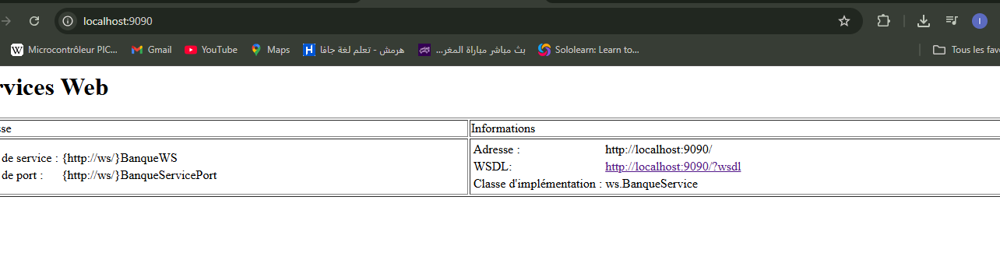
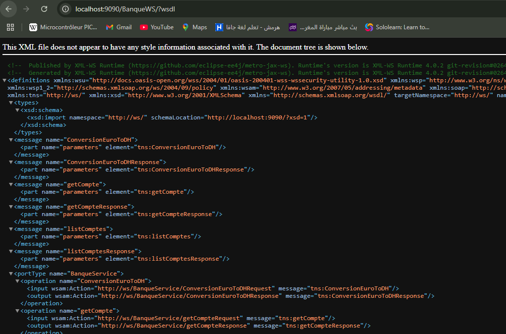
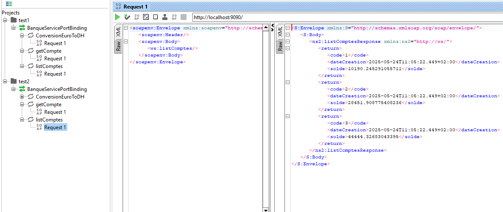

# Rapport TP4 : Création d’un Web Service SOAP avec JAX-WS

---

## Objectif du TP

Le but de ce TP est de créer un Web Service SOAP en Java permettant de :

- Convertir un montant de l’euro vers le dirham marocain (DH).
- Consulter un compte bancaire via son identifiant.
- Consulter une liste de comptes bancaires.

Ensuite, ce service doit être déployé localement, son WSDL analysé, testé avec un outil SOAP, puis utilisé via un client Java.

---

## Déroulement et Réalisation

### Création du Web Service

Nous avons conçu un service appelé **BanqueWS** exposant plusieurs méthodes accessibles via le protocole SOAP. Ce service fournit :

- Une conversion de devise (euro en dirham).
- La consultation d’un compte unique.
- La consultation d’une liste de comptes.

Les comptes utilisés sont simulés avec des valeurs aléatoires de solde et une date de création.

---

### Déploiement du service

Le Web Service a été déployé sur un serveur local accessible à l’adresse suivante :  
`http://localhost:9090/`

Cela permet d’y accéder via un navigateur ou un client SOAP.

---

### Analyse du WSDL

Le fichier WSDL, qui décrit les opérations disponibles du service, est accessible à :  
`http://localhost:9090/BanqueWS/?wsdl`

Ce document XML est essentiel car il informe les clients SOAP des méthodes, paramètres, et formats d’échange pour interagir avec le service.

---

### Test avec SoapUI

Pour valider le bon fonctionnement, le service a été testé avec l’outil **SoapUI**.  

Cet outil a permis d’envoyer des requêtes SOAP au service et de vérifier les réponses retournées pour chaque opération (conversion, consultation compte, consultation liste).

---

### Création du client Java

Un client Java a été développé pour consommer ce Web Service. Ce client utilise le WSDL pour générer des classes proxy, facilitant l’appel des méthodes du service.  

Il affiche ensuite les résultats dans la console.

---

## Technologies utilisées

- **Java** avec JAX-WS pour créer le Web Service SOAP.
- **Maven** pour la gestion de projet.
- **SoapUI** pour le test des requêtes SOAP.
- Serveur local JAX-WS embarqué pour le déploiement.

---

## Résultats

- Le service est accessible via un navigateur.
- Le WSDL est consultable et valide.
- Les tests dans SoapUI confirment que les opérations fonctionnent correctement.
- Le client Java peut invoquer les opérations du service et récupérer les données.

---

## Captures d’écran

| Description                     | Image                             |
|--------------------------------|----------------------------------|
| Service déployé sur localhost  |  |
| WSDL affiché dans le navigateur|               |
| Test des opérations via SoapUI |            |

---

## Conclusion

Ce TP a permis d’acquérir une expérience pratique dans la création et le déploiement d’un Web Service SOAP avec Java.  

La compréhension du rôle du WSDL, l’utilisation d’outils de test comme SoapUI et la mise en place d’un client Java sont des compétences clés pour le développement d’applications distribuées.

---
